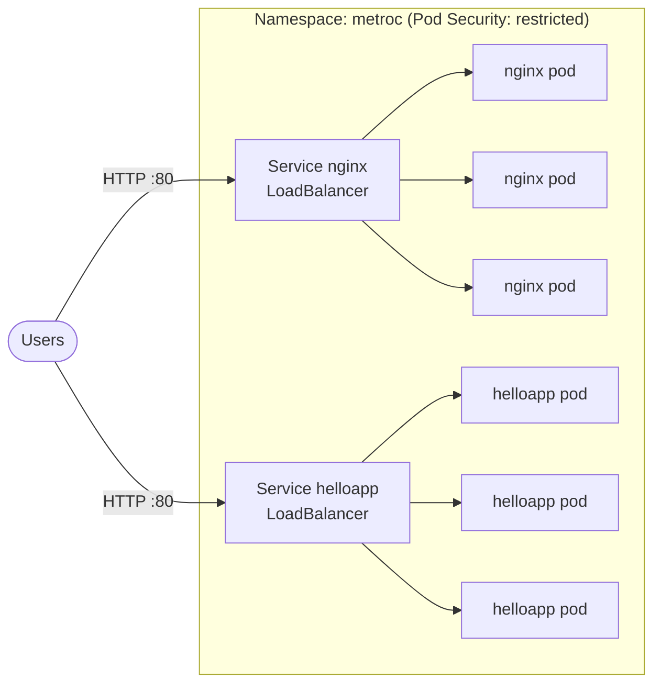

# Kubernetes Deployments: NGINX and Hello App


Two web applications deployed on Kubernetes, each with 3 replicas behind a `LoadBalancer` Service. The manifests follow production best practices: health checks, resource limits, non-root containers and the **restricted** Pod Security Standard. Every change is validated and test-deployed automatically by GitHub Actions.

## Architecture



| Application | Image | Replicas | Container port | Service |
|---|---|---|---|---|
| **nginx** | `nginxinc/nginx-unprivileged:1.30-alpine` | 3 | 8080 | `LoadBalancer` port 80 |
| **helloapp** | `us-docker.pkg.dev/google-samples/containers/gke/hello-app:1.0` | 3 | 8080 | `LoadBalancer` port 80 |

## What each Deployment includes

| Practice | Why it matters |
|---|---|
| **Readiness and liveness probes** | Traffic only goes to pods that are ready, and frozen pods are restarted automatically |
| **CPU/memory requests and memory limits** | The scheduler places pods correctly, and one pod cannot use all of a node's memory |
| **Rolling updates with `maxUnavailable: 0`** | New versions roll out with no downtime |
| **Topology spread** | Replicas are spread across nodes, so one node failure doesn't take the app down |
| **Non-root, read-only filesystem, all capabilities dropped** | Limits what an attacker can do if a container is compromised |
| **Restricted Pod Security Standard on the namespace** | Kubernetes refuses any pod that doesn't meet these rules |
| **Recommended labels** (`app.kubernetes.io/*`) | Standard labels used by tools such as `kubectl`, dashboards and monitoring |

## Project structure

```
k8s/
├── kustomization.yaml       # Lists all resources; sets namespace and common labels
├── namespace.yaml           # "metroc" namespace with Pod Security "restricted"
├── nginx/
│   ├── deployment.yaml
│   └── service.yaml
└── helloapp/
    ├── deployment.yaml
    └── service.yaml
.github/workflows/ci.yml     # Validate + test deployment on every push
```

## Deploy

Works on any cluster: GKE, EKS, AKS, minikube or kind. You need `kubectl` connected to the cluster.

```bash
# Deploy everything (namespace, deployments, services)
kubectl apply -k k8s

# Check the pods and services
kubectl -n metroc get pods,svc

# Wait until the load balancers get an external IP
kubectl -n metroc get svc -w
```

Then open `http://<EXTERNAL-IP>` for each service:

- **nginx** shows the "Welcome to nginx!" page.
- **helloapp** shows `Hello, world!`, the version, and the name of the pod that answered. Refresh the page to watch the load balancer switch between the 3 pods.

> **Local clusters (minikube / kind):** `LoadBalancer` services stay `<pending>`. Use `minikube tunnel`, or `kubectl -n metroc port-forward svc/helloapp 8080:80` and open http://localhost:8080.

### Useful commands

```bash
# Scale an application
kubectl -n metroc scale deployment/helloapp --replicas=5

# Rolling update to a new version, then watch it
kubectl -n metroc set image deployment/helloapp helloapp=us-docker.pkg.dev/google-samples/containers/gke/hello-app:2.0
kubectl -n metroc rollout status deployment/helloapp

# Roll back if something goes wrong
kubectl -n metroc rollout undo deployment/helloapp

# Logs from all nginx pods
kubectl -n metroc logs -l app.kubernetes.io/name=nginx
```

### Clean up

```bash
kubectl delete -k k8s
```

Delete the services when you're done: each `LoadBalancer` creates a paid cloud load balancer.

## Continuous integration

On every push, GitHub Actions:

1. **Validates** the manifests: it builds them with Kustomize and checks them against the official Kubernetes schemas with `kubeconform`.
2. **Test-deploys** them to a temporary [kind](https://kind.sigs.k8s.io/) cluster. It waits for both rollouts and checks that each app answers with the expected page.

## Possible next steps

- Replace the two load balancers with a single **Ingress** (one IP, path- or host-based routing).
- Add a **HorizontalPodAutoscaler** to scale on CPU usage.
- Add **NetworkPolicies** to restrict pod-to-pod traffic.

## Skills demonstrated

Kubernetes · Deployments & Services · Kustomize · Health probes · Resource management · Pod Security Standards · Rolling updates & rollbacks · GitHub Actions · kind
